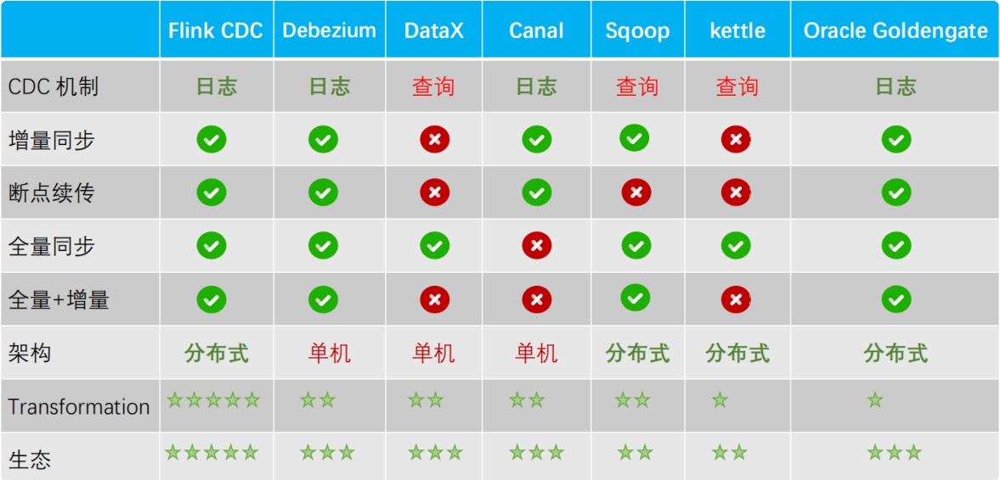

# CDC
在⼴义的概念上，只要能捕获数据变更的技术，我们都可以称为 CDC。
通常我们说的 CDC 技术主要⾯向数据库的变更，是⼀种⽤于捕获数据库中
数据变更的技术，全称是：（Change Data Capture）

# 实现方式
## 基于查询的方案
离线调度查询作业，批处理。把一张表同步到其他系统，每次通过查询去获取表中最新的数据；

**优点：** 
1. 实现简单，不需要对数据库进行任何改造，只需要通过查询获取数据即可；

**缺点：** 
1. ⽆法保证数据⼀致性
2. 实时性基于调度频率
2. 对DB造成读压⼒

## 基于日志方案
实时消费日志，流处理，例如 MySQL 的 binlog 日志完整记录了数据库中的变更，可以把 binlog 文件当作流的数据源；

**优点：**
1. 实时消费变更⽇志
2. ⾼效，低延迟
3. 对DB没有压力

**缺点：**
1. 实现相对复杂，需要对数据库进行改造，⽐如开启 binlog 
2. 需要数据库配置和账号权限

# 对比
常见的CDC技术有：Maxwell、Debezium、Canal、DataX、FlinkCDC等，下面对这些技术进行对比。
 
