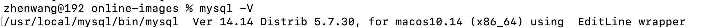
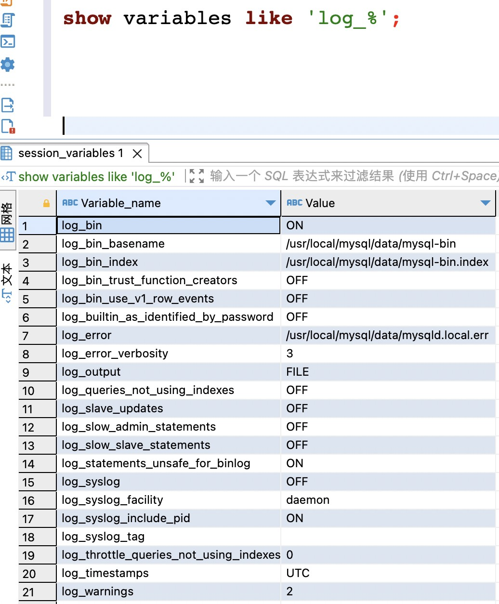

# 一、什么是canal

[canal](https://github.com/alibaba/canal ) github链接

canal [kə'næl]，译意为水道/管道/沟渠，主要用途是基于 MySQL 数据库增量日志解析，提供增量数据订阅和消费

## canal能做什么

- 数据库镜像
- 数据库实时备份
- 索引构建和实时维护(拆分异构索引、倒排索引等)
- 业务 cache 刷新
- 带业务逻辑的增量数据处理

# 二、工作原理

### MySQL主备复制原理

[MySQL主备复制原理-官网](https://camo.githubusercontent.com/c26e367a6ffcce8ae6ecb39476a01bef14af6572124a6df050c4dc0c7f1074f3/687474703a2f2f646c2e69746579652e636f6d2f75706c6f61642f6174746163686d656e742f303038302f333038362f34363863316131342d653761642d333239302d396433642d3434616335303161373232372e6a7067 )

- MySQL master 将数据变更写入二进制日志( binary log, 其中记录叫做二进制日志事件binary log events，可以通过 show binlog events 进行查看)
- MySQL slave 将 master 的 binary log events 拷贝到它的中继日志(relay log)
- MySQL slave 重放 relay log 中事件，将数据变更反映它自己的数据

参考：

[Mysql Binlog 的原理解析](https://www.bloghome.com.cn/post/mysqlde-binlogyuan-li.html)。

[MySQL的主备同步原理及过程](https://blog.csdn.net/ArtAndLife/article/details/117603630)

### canal

- canal 模拟 MySQL slave 的交互协议，伪装自己为 MySQL slave ，向 MySQL master 发送dump 协议
- MySQL master 收到 dump 请求，开始推送 binary log 给 slave (即 canal )
- canal 解析 binary log 对象(原始为 byte 流)
  

# 三、canal服务

当前的 canal 支持源端 MySQL 版本包括 5.1.x , 5.5.x , 5.6.x , 5.7.x , 8.0.x

## 准备

1、mysql-erver [mac安装mysql](https://zhuanlan.zhihu.com/p/168753680)

  

2、开启binlog

对于自建 MySQL , 需要先开启 Binlog 写入功能，配置 binlog-format 为 ROW 模式，my.cnf 中配置如下

查找macmysql的安装路径：

```
mysql --help --verbose | grep my.cnf
                       order of preference, my.cnf, $MYSQL_TCP_PORT,
 /etc/my.cnf /etc/mysql/my.cnf /usr/local/mysql/etc/my.cnf ~/.my.cnf 
```

```
[mysqld]
log-bin=mysql-bin # 开启 binlog
binlog-format=ROW # 选择 ROW 模式
server_id=1 # 配置 MySQL replaction 需要定义，不要和 canal 的 slaveId 重复
```

验证binlog是否开启状态

```
show variables like 'log_%';
```

  

3、账号

授权 canal 链接 MySQL 账号具有作为 MySQL slave 的权限, 如果已有账户可直接 grant

```
CREATE USER canal IDENTIFIED BY 'canal';  
GRANT ALL PRIVILEGES ON *.* TO 'canal'@'%' ;
FLUSH PRIVILEGES;
```

## 启动canal

[canal release](https://github.com/alibaba/canal/wiki/QuickStart,"")

### 下载

```
wget https://github.com/alibaba/canal/releases/download/canal-1.1.6/canal.deployer-1.1.6.tar.gz
```

### 解压

```
mkdir /tmp/canal
tar zxvf canal.deployer-1.1.6.tar.gz  -C /tmp/canal
```

### 修改配置

```
code  conf/example/instance.properties
```

```
#################################################
## mysql serverId , v1.0.26+ will autoGen
# canal.instance.mysql.slaveId=1001 

# enable gtid use true/false
canal.instance.gtidon=false

# position info
canal.instance.master.address=127.0.0.1:3306
canal.instance.master.journal.name=
canal.instance.master.position=
canal.instance.master.timestamp=
canal.instance.master.gtid=

# rds oss binlog
canal.instance.rds.accesskey=
canal.instance.rds.secretkey=
canal.instance.rds.instanceId=

# table meta tsdb info
canal.instance.tsdb.enable=true
#canal.instance.tsdb.url=jdbc:mysql://127.0.0.1:3306/canal_tsdb
#canal.instance.tsdb.dbUsername=canal
#canal.instance.tsdb.dbPassword=canal

#canal.instance.standby.address =
#canal.instance.standby.journal.name =
#canal.instance.standby.position =
#canal.instance.standby.timestamp =
#canal.instance.standby.gtid=

# username/password
canal.instance.dbUsername=canal
canal.instance.dbPassword=canal
canal.instance.connectionCharset = UTF-8
# enable druid Decrypt database password
canal.instance.enableDruid=false
#canal.instance.pwdPublicKey=MFwwDQYJKoZIhvcNAQEBBQADSwAwSAJBALK4BUxdDltRRE5/zXpVEVPUgunvscYFtEip3pmLlhrWpacX7y7GCMo2/JM6LeHmiiNdH1FWgGCpUfircSwlWKUCAwEAAQ==

# table regex
canal.instance.filter.regex=.*\\..*
# table black regex
canal.instance.filter.black.regex=mysql\\.slave_.*
# table field filter(format: schema1.tableName1:field1/field2,schema2.tableName2:field1/field2)
#canal.instance.filter.field=test1.t_product:id/subject/keywords,test2.t_company:id/name/contact/ch
# table field black filter(format: schema1.tableName1:field1/field2,schema2.tableName2:field1/field2)
#canal.instance.filter.black.field=test1.t_product:subject/product_image,test2.t_company:id/name/contact/ch

# mq config
canal.mq.topic=example
# dynamic topic route by schema or table regex
#canal.mq.dynamicTopic=mytest1.user,topic2:mytest2\\..*,.*\\..*
canal.mq.partition=0
# hash partition config
#canal.mq.enableDynamicQueuePartition=false
#canal.mq.partitionsNum=3
#canal.mq.dynamicTopicPartitionNum=test.*:4,mycanal:6
#canal.mq.partitionHash=test.table:id^name,.*\\..*
#################################################

```

### 启动

```
sh bin/startup.sh 
```

### 查看日志

```
# servers日志
vi logs/canal/canal.log</pre>

# instance 日志
vi logs/example/example.log

```

### 关闭

```
sh bin/stop.sh 
```

# 四、使用

## 开启客户端连接

```java
package com.netease.canalclient;

import java.net.InetSocketAddress;
import java.util.List;


import com.alibaba.otter.canal.client.CanalConnectors;
import com.alibaba.otter.canal.client.CanalConnector;
import com.alibaba.otter.canal.protocol.Message;
import com.alibaba.otter.canal.protocol.CanalEntry.Column;
import com.alibaba.otter.canal.protocol.CanalEntry.Entry;
import com.alibaba.otter.canal.protocol.CanalEntry.EntryType;
import com.alibaba.otter.canal.protocol.CanalEntry.EventType;
import com.alibaba.otter.canal.protocol.CanalEntry.RowChange;
import com.alibaba.otter.canal.protocol.CanalEntry.RowData;


public class SimpleCanalClientExample {


    public static void main(String args[]) {
        // 创建链接
        CanalConnector connector = CanalConnectors.newSingleConnector(new InetSocketAddress("127.0.0.1",
                11111), "example", "", "");
        int batchSize = 1000;
        int emptyCount = 0;
        try {
            connector.connect();
            connector.subscribe(".*\\..*");
            connector.rollback();
            int totalEmptyCount = 120;
            while (emptyCount < totalEmptyCount) {
                Message message = connector.getWithoutAck(batchSize); // 获取指定数量的数据
                long batchId = message.getId();
                int size = message.getEntries().size();
                if (batchId == -1 || size == 0) {
                    emptyCount++;
                    System.out.println("empty count : " + emptyCount);
                    try {
                        Thread.sleep(1000);
                    } catch (InterruptedException e) {
                    }
                } else {
                    emptyCount = 0;
                    // System.out.printf("message[batchId=%s,size=%s] \n", batchId, size);
                    printEntry(message.getEntries());
                }

                connector.ack(batchId); // 提交确认
                // connector.rollback(batchId); // 处理失败, 回滚数据
            }

            System.out.println("empty too many times, exit");
        } finally {
            connector.disconnect();
        }
    }

    private static void printEntry(List<Entry> entrys) {
        for (Entry entry : entrys) {
            if (entry.getEntryType() == EntryType.TRANSACTIONBEGIN || entry.getEntryType() == EntryType.TRANSACTIONEND) {
                continue;
            }

            RowChange rowChage = null;
            try {
                rowChage = RowChange.parseFrom(entry.getStoreValue());
            } catch (Exception e) {
                throw new RuntimeException("ERROR ## parser of eromanga-event has an error , data:" + entry.toString(),
                        e);
            }

            EventType eventType = rowChage.getEventType();
            System.out.println(String.format("================> binlog[%s:%s] , name[%s,%s] , eventType : %s",
                    entry.getHeader().getLogfileName(), entry.getHeader().getLogfileOffset(),
                    entry.getHeader().getSchemaName(), entry.getHeader().getTableName(),
                    eventType));

            for (RowData rowData : rowChage.getRowDatasList()) {
                if (eventType == EventType.DELETE) {
                    printColumn(rowData.getBeforeColumnsList());
                } else if (eventType == EventType.INSERT) {
                    printColumn(rowData.getAfterColumnsList());
                } else {
                    System.out.println("-------> before");
                    printColumn(rowData.getBeforeColumnsList());
                    System.out.println("-------> after");
                    printColumn(rowData.getAfterColumnsList());
                }
            }
        }
    }

    private static void printColumn(List<Column> columns) {
        for (Column column : columns) {
            System.out.println(column.getName() + " : " + column.getValue() + "    update=" + column.getUpdated());
        }
    }

}
```

## 尝试在mysql表插入代码

```sql
use project_test;
INSERT INTO pp_biz_project_reality_income_node
( create_time, update_time, is_delete, create_operator, last_operator, remark, project_id, contract_no, version, income_node_id, node_id, percentage, revenue_detail_id, invoice_content_id, `month`, node_remark_id, check_percentage, special_date, check_amount, node_amount)
VALUES( '2022-02-18 13:54:54', '2022-02-18 14:49:13', 1, 'wb.shixiaoying01@mesg.corp.netease.com', 'wb.shixiaoying01@mesg.corp.netease.com', '', 409, '123242sfd', 202202, 410, 1000000001, 0.0600, 345, 1, '2021-07', 0, NULL, NULL, NULL, NULL);

```

## 客户端监听结果

```log
================> binlog[mysql-bin.000001:1237] , name[project_test,pp_biz_project_reality_income_node] , eventType : INSERT
id : 26379    update=true
create_time : 2022-02-18 13:54:54    update=true
update_time : 2022-02-18 14:49:13    update=true
is_delete : 1    update=true
create_operator : wb.shixiaoying01@mesg.corp.netease.com    update=true
last_operator : wb.shixiaoying01@mesg.corp.netease.com    update=true
remark :     update=true
project_id : 409    update=true
contract_no : 123242sfd    update=true
version : 202202    update=true
income_node_id : 410    update=true
node_id : 1000000001    update=true
percentage : 0.0600    update=true
revenue_detail_id : 345    update=true
invoice_content_id : 1    update=true
month : 2021-07    update=true
node_remark_id : 0    update=true
check_percentage :     update=true
special_date :     update=true
check_amount :     update=true
node_amount :     update=true
```
