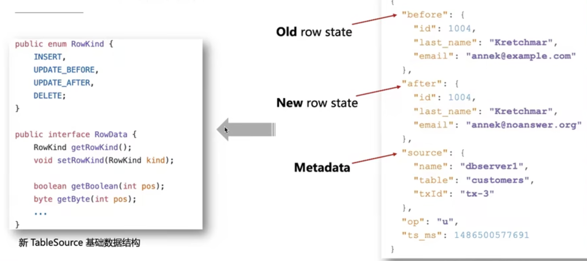
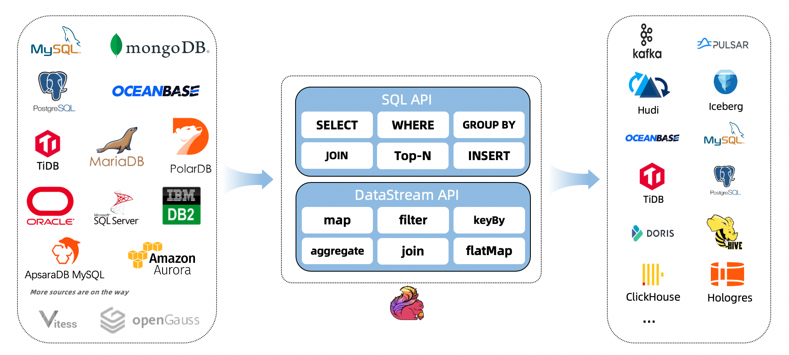

# Flink CDC
[什么是 Flink CDC](https://github.com/ververica/flink-cdc-connectors)

[Flink学习网](https://flink-learning.org.cn/)

# Flink SQL 如何集成 CDC
## 为什么Flink 要做 SQL CDC
### 背景
Flink 目前的生态对于业务的日志，有比较好的支持，但是对于数据库的变更，却没有很好的原生支持，所以 Flink CDC 就是为了解决这个问题。
Flink SQL 已经完整的支持了

很早就已经支持 dynamic table 、流表二象性

### 实现
依赖 Debezium

### 作为transform

### Demo1、 Flink SQL CDC + JDBC Connector

[《Flink JDBC Connector: Flink 与数据库集成最佳实践》](https://www.bilibili.com/video/BV1bp4y1q78d/?vd_source=813e06e79e80b4bb9b0ae52ab18d766c)

## Flink SQL CDC （采集+计算+传输）
[flink-cdc-connectors](https://github.com/ververica/flink-cdc-connectors)

### Demo2、CDC Streaming ETL

## 概述
[Overview](https://ververica.github.io/flink-cdc-connectors/master/content/about.html) 

## 支持的连接器

## 特性
- 支持读取数据库快照，即使发生故障也能继续读取事务日志，并进行一次性处理。
- DataStream API 的 CDC 连接器，用户可以在单个作业中使用多个数据库和表的更改，而无需部署 Debezium 和 Kafka。
- Table/SQL API 的 CDC 连接器，用户可以使用 SQL DDL 创建 CDC 源来监视单个表上的更改。
